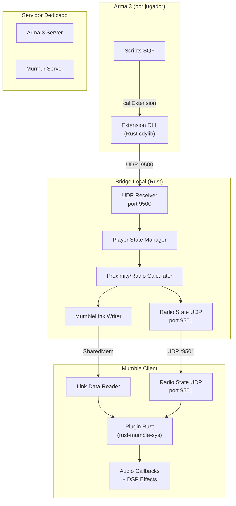
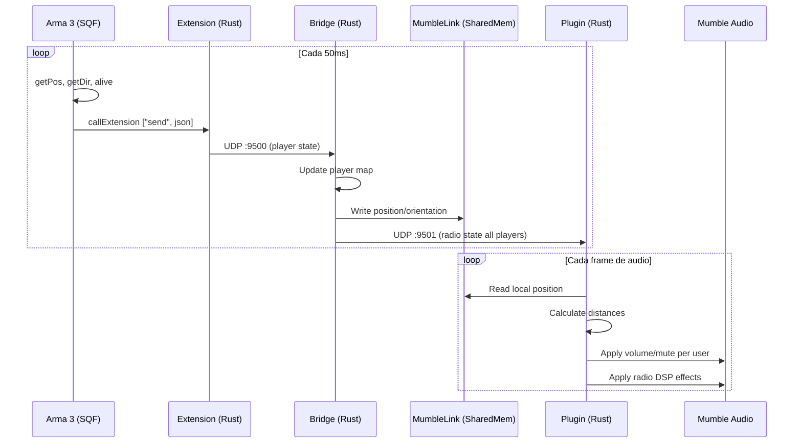

# RMTFAR: Radio Mumble para Task Force Arma

Sistema de comunicación por voz tipo TFAR para Arma 3 usando Mumble/Murmur.
**Stack completo en Rust. Licencia GPLv3.**

## Licencia

**GPLv3** - Compatible con:
- Mumble (GPLv3)
- ACRE2 (GPLv3)
- Mods de Arma 3 originales (sin assets de BI)

El código SQF del mod de Arma 3 también se licencia bajo GPLv3. No se usan assets de Bohemia Interactive, por lo que no aplica APL-SA.

## Arquitectura General



## Flujo de Datos Detallado



## Estructura del Repositorio

```
rmtfar/
├── Cargo.toml                       # Workspace root
├── LICENSE                          # GPLv3
├── README.md
├── docs/
│   ├── architecture.md
│   ├── protocol.md
│   ├── building.md
│   └── setup-guide.md
│
├── crates/
│   ├── rmtfar-protocol/             # Tipos compartidos
│   │   ├── Cargo.toml
│   │   └── src/
│   │       └── lib.rs               # PlayerState, RadioState, Message
│   │
│   ├── rmtfar-extension/            # Extension DLL para Arma 3
│   │   ├── Cargo.toml               # cdylib, links to arma3
│   │   └── src/
│   │       ├── lib.rs               # RVExtension exports
│   │       └── sender.rs            # UDP sender
│   │
│   ├── rmtfar-bridge/               # Bridge local
│   │   ├── Cargo.toml
│   │   └── src/
│   │       ├── main.rs
│   │       ├── state.rs             # Player state manager
│   │       ├── mumble_link.rs       # SharedMem writer
│   │       └── radio.rs             # Radio logic
│   │
│   ├── rmtfar-plugin/               # Plugin Mumble
│   │   ├── Cargo.toml               # depends on mumble-sys
│   │   ├── build.rs                 # Link mumble headers
│   │   └── src/
│   │       ├── lib.rs               # MumblePlugin impl
│   │       ├── audio.rs             # Audio callbacks
│   │       ├── dsp.rs               # Radio effects (bandpass, noise)
│   │       └── state.rs             # Radio state receiver
│   │
│   └── rmtfar-test-client/          # Cliente de prueba
│       ├── Cargo.toml
│       └── src/
│           └── main.rs              # Simula Arma 3
│
├── arma-mod/                        # Mod de Arma 3
│   └── @rmtfar/
│       ├── mod.cpp                  # Metadata
│       ├── addons/
│       │   └── rmtfar/
│       │       ├── config.cpp
│       │       ├── CfgFunctions.hpp
│       │       ├── XEH_preInit.sqf
│       │       ├── XEH_postInit.sqf
│       │       └── functions/
│       │           ├── fn_init.sqf
│       │           ├── fn_loop.sqf
│       │           ├── fn_getPlayerState.sqf
│       │           ├── fn_sendState.sqf
│       │           ├── fn_setFrequency.sqf
│       │           └── fn_radioTransmit.sqf
│       └── rmtfar_x64.dll           # Compiled extension
│
└── scripts/
    ├── build-all.sh                 # Build workspace
    ├── build-extension.sh           # Cross-compile for Windows
    └── package-release.sh           # Create release zip
```

## Protocolo de Mensajes

### Arma -> Bridge (UDP :9500)

Formato: JSON sobre UDP, un mensaje por paquete.

```json
{
  "v": 1,
  "type": "player_state",
  "steam_id": "76561198000000000",
  "server_id": "192.168.1.100:2302",
  "tick": 123456,
  "pos": [1234.5, 567.8, 12.3],
  "dir": 145.0,
  "alive": true,
  "conscious": true,
  "vehicle": null,
  "ptt_local": false,
  "ptt_radio_sr": false,
  "ptt_radio_lr": false,
  "radio_sr": {
    "freq": "152.000",
    "channel": 1,
    "volume": 1.0,
    "enabled": true
  },
  "radio_lr": null
}
```

### Bridge -> Plugin (UDP :9501)

Estado consolidado de todos los jugadores en el servidor.

```json
{
  "v": 1,
  "type": "radio_state",
  "server_id": "192.168.1.100:2302",
  "tick": 123456,
  "local_player": "76561198000000000",
  "players": [
    {
      "steam_id": "76561198000000000",
      "pos": [1234.5, 567.8, 12.3],
      "dir": 145.0,
      "alive": true,
      "transmitting_local": false,
      "transmitting_radio": true,
      "radio_freq": "152.000"
    }
  ]
}
```

### Campos Clave

- `v`: version del protocolo (para compatibilidad futura)
- `pos`: [x, y, z] en metros (Arma usa metros nativamente)
- `dir`: heading en grados (0-360, 0 = norte)
- `ptt_local`: push-to-talk para voz directa (proximidad)
- `ptt_radio_sr`: PTT para radio de corto alcance
- `ptt_radio_lr`: PTT para radio de largo alcance
- `radio_sr.power`: "SR" = 5km, "LR" = 20km (Fase 3)

## Ejemplo Minimo SQF (Arma 3 Mod)

```sqf
// XEH_postInit.sqf - Inicializacion con CBA
if (!hasInterface) exitWith {};

private _version = "rmtfar" callExtension "version";
if (_version == "") exitWith {
    diag_log "RMTFAR: Extension not loaded";
};

RMTFAR_enabled = true;
RMTFAR_radioFreq = "152.000";
RMTFAR_radioChannel = 1;

// Keys (configurables via CBA settings)
RMTFAR_keyPttLocal = 0x3A;    // Caps Lock
RMTFAR_keyPttRadio = 0x14;    // T

// Iniciar loop principal
[] spawn RMTFAR_fnc_loop;

diag_log format ["RMTFAR: Initialized v%1", _version];
```

```sqf
// fn_loop.sqf - Loop principal 20Hz
while {RMTFAR_enabled} do {
    if (!isNull player && {alive player}) then {
        private _state = call RMTFAR_fnc_getPlayerState;
        [_state] call RMTFAR_fnc_sendState;
    };
    sleep 0.05;
};
```

```sqf
// fn_getPlayerState.sqf
private _pos = getPosASL player;
private _dir = getDir player;
private _alive = alive player;
private _conscious = player getVariable ["ACE_isUnconscious", false];
private _vehicle = if (vehicle player != player) then {
    typeOf (vehicle player)
} else { "" };

private _pttLocal = (GetKeyState RMTFAR_keyPttLocal) > 0;
private _pttRadio = (GetKeyState RMTFAR_keyPttRadio) > 0;

// Retornar hashmap
createHashMapFromArray [
    ["uid", getPlayerUID player],
    ["pos", _pos],
    ["dir", _dir],
    ["alive", _alive],
    ["conscious", !_conscious],
    ["vehicle", _vehicle],
    ["ptt_local", _pttLocal],
    ["ptt_radio_sr", _pttRadio],
    ["radio_freq", RMTFAR_radioFreq],
    ["radio_channel", RMTFAR_radioChannel]
]
```

```sqf
// fn_sendState.sqf
params ["_state"];

private _json = format [
    '{"v":1,"type":"player_state","steam_id":"%1","server_id":"%2","pos":[%3,%4,%5],"dir":%6,"alive":%7,"conscious":%8,"ptt_local":%9,"ptt_radio_sr":%10,"radio_sr":{"freq":"%11","channel":%12}}',
    _state get "uid",
    serverName,
    (_state get "pos") select 0,
    (_state get "pos") select 1,
    (_state get "pos") select 2,
    _state get "dir",
    _state get "alive",
    _state get "conscious",
    _state get "ptt_local",
    _state get "ptt_radio_sr",
    _state get "radio_freq",
    _state get "radio_channel"
];

"rmtfar" callExtension ["send", [_json]];
```

## Ejemplo: Extension Arma 3 (Rust)

```rust
// crates/rmtfar-extension/src/lib.rs
use std::ffi::{c_char, c_int, CStr};
use std::net::UdpSocket;
use std::sync::OnceLock;

static SOCKET: OnceLock<UdpSocket> = OnceLock::new();
const BRIDGE_ADDR: &str = "127.0.0.1:9500";
const VERSION: &str = env!("CARGO_PKG_VERSION");

fn get_socket() -> &'static UdpSocket {
    SOCKET.get_or_init(|| {
        let socket = UdpSocket::bind("127.0.0.1:0").expect("Failed to bind UDP socket");
        socket.connect(BRIDGE_ADDR).expect("Failed to connect to bridge");
        socket
    })
}

/// Entry point llamado por Arma 3
/// Signature: void RVExtension(char *output, int outputSize, const char *function)
#[no_mangle]
pub unsafe extern "C" fn RVExtension(
    output: *mut c_char,
    output_size: c_int,
    function: *const c_char,
) {
    let func = CStr::from_ptr(function).to_string_lossy();
    
    let result = match func.as_ref() {
        "version" => VERSION.to_string(),
        _ => String::new(),
    };
    
    write_output(output, output_size, &result);
}

/// Entry point con argumentos: int RVExtensionArgs(...)
#[no_mangle]
pub unsafe extern "C" fn RVExtensionArgs(
    output: *mut c_char,
    output_size: c_int,
    function: *const c_char,
    args: *const *const c_char,
    arg_count: c_int,
) -> c_int {
    let func = CStr::from_ptr(function).to_string_lossy();
    
    match func.as_ref() {
        "send" if arg_count >= 1 => {
            let json = CStr::from_ptr(*args).to_string_lossy();
            if let Err(e) = get_socket().send(json.as_bytes()) {
                eprintln!("RMTFAR: Send error: {}", e);
                return -1;
            }
            0
        }
        _ => -1,
    }
}

#[no_mangle]
pub unsafe extern "C" fn RVExtensionVersion(
    output: *mut c_char,
    output_size: c_int,
) {
    write_output(output, output_size, VERSION);
}

unsafe fn write_output(output: *mut c_char, size: c_int, data: &str) {
    let bytes = data.as_bytes();
    let len = bytes.len().min((size - 1) as usize);
    std::ptr::copy_nonoverlapping(bytes.as_ptr(), output as *mut u8, len);
    *output.add(len) = 0;
}
```

## Ejemplo: Bridge (Rust)

```rust
// crates/rmtfar-bridge/src/main.rs
use rmtfar_protocol::{PlayerState, RadioStateMessage};
use std::collections::HashMap;
use std::net::UdpSocket;
use std::sync::{Arc, RwLock};
use std::thread;

mod mumble_link;
use mumble_link::MumbleLink;

type PlayerMap = Arc<RwLock<HashMap<String, PlayerState>>>;

fn main() -> anyhow::Result<()> {
    let rx_socket = UdpSocket::bind("127.0.0.1:9500")?;
    let tx_socket = UdpSocket::bind("127.0.0.1:0")?;
    tx_socket.connect("127.0.0.1:9501")?;
    
    let players: PlayerMap = Arc::new(RwLock::new(HashMap::new()));
    let mut mumble_link = MumbleLink::new();
    let mut buf = [0u8; 4096];
    
    println!("RMTFAR Bridge v{}", env!("CARGO_PKG_VERSION"));
    println!("Listening on 127.0.0.1:9500");
    
    loop {
        let (len, _src) = rx_socket.recv_from(&mut buf)?;
        
        if let Ok(state) = serde_json::from_slice::<PlayerState>(&buf[..len]) {
            let steam_id = state.steam_id.clone();
            
            // Update MumbleLink for local player positional audio
            if let Some(ref mut link) = mumble_link {
                let front = dir_to_vector(state.dir);
                link.update(state.pos, front, &state.steam_id, &state.server_id);
            }
            
            // Store player state
            players.write().unwrap().insert(steam_id.clone(), state);
            
            // Broadcast radio state to plugin
            let radio_msg = build_radio_message(&players.read().unwrap(), &steam_id);
            if let Ok(json) = serde_json::to_vec(&radio_msg) {
                let _ = tx_socket.send(&json);
            }
        }
    }
}

fn dir_to_vector(dir_degrees: f32) -> [f32; 3] {
    let rad = dir_degrees.to_radians();
    [rad.sin(), 0.0, rad.cos()]
}

fn build_radio_message(players: &HashMap<String, PlayerState>, local: &str) -> RadioStateMessage {
    RadioStateMessage {
        v: 1,
        server_id: players.get(local).map(|p| p.server_id.clone()).unwrap_or_default(),
        local_player: local.to_string(),
        players: players.values().cloned().collect(),
    }
}
```

## Ejemplo: Plugin Mumble (Rust)

```rust
// crates/rmtfar-plugin/src/lib.rs
use mumble_sys::{MumbleAPI, MumblePlugin};
use std::net::UdpSocket;
use std::sync::{Arc, RwLock};

mod audio;
mod dsp;
mod state;

use state::RadioState;

struct RmtfarPlugin {
    api: Option<MumbleAPI>,
    radio_state: Arc<RwLock<RadioState>>,
    rx_socket: Option<UdpSocket>,
}

impl MumblePlugin for RmtfarPlugin {
    fn get_name(&self) -> &'static str { "RMTFAR" }
    fn get_author(&self) -> &'static str { "RMTFAR Team" }
    fn get_description(&self) -> &'static str { 
        "Radio communication for Arma 3" 
    }
    fn get_version(&self) -> (u32, u32, u32) { (0, 1, 0) }
    
    fn set_api(&mut self, api: MumbleAPI) {
        self.api = Some(api);
    }
    
    fn on_plugin_start(&mut self) -> bool {
        // Bind UDP socket for radio state
        match UdpSocket::bind("127.0.0.1:9501") {
            Ok(socket) => {
                socket.set_nonblocking(true).ok();
                self.rx_socket = Some(socket);
                true
            }
            Err(e) => {
                eprintln!("RMTFAR: Failed to bind UDP: {}", e);
                false
            }
        }
    }
    
    fn on_audio_source_about_to_be_heard(
        &mut self,
        user_id: u32,
        samples: &mut [f32],
        sample_rate: u32,
        is_speech: bool,
    ) -> bool {
        // Receive latest radio state
        self.poll_radio_state();
        
        let state = self.radio_state.read().unwrap();
        
        // Find user's player state
        let Some(user_state) = state.find_by_mumble_id(user_id) else {
            return true; // Unknown user, pass through
        };
        
        let Some(local_state) = state.local_player() else {
            return true;
        };
        
        // Calculate if we should hear this user
        let distance = calculate_distance(&local_state.pos, &user_state.pos);
        
        // Local voice: proximity based
        if !user_state.transmitting_radio {
            if distance > 50.0 || !local_state.alive {
                return false; // Mute
            }
            let volume = 1.0 - (distance / 50.0).min(1.0);
            audio::apply_volume(samples, volume);
            return true;
        }
        
        // Radio voice: frequency based
        if user_state.radio_freq != local_state.radio_freq {
            return false; // Different frequency, mute
        }
        
        // Apply radio effect
        dsp::apply_radio_effect(samples, sample_rate, distance);
        true
    }
    
    fn on_plugin_stop(&mut self) {
        self.rx_socket = None;
    }
}

impl RmtfarPlugin {
    fn poll_radio_state(&mut self) {
        let Some(ref socket) = self.rx_socket else { return };
        
        let mut buf = [0u8; 8192];
        while let Ok(len) = socket.recv(&mut buf) {
            if let Ok(msg) = serde_json::from_slice(&buf[..len]) {
                *self.radio_state.write().unwrap() = msg;
            }
        }
    }
}

fn calculate_distance(a: &[f32; 3], b: &[f32; 3]) -> f32 {
    let dx = a[0] - b[0];
    let dy = a[1] - b[1];
    let dz = a[2] - b[2];
    (dx*dx + dy*dy + dz*dz).sqrt()
}

// Export plugin to Mumble
mumble_sys::export_plugin!(RmtfarPlugin::default());
```

## Ejemplo: DSP Radio Effect (Rust)

```rust
// crates/rmtfar-plugin/src/dsp.rs
use std::f32::consts::PI;

pub fn apply_radio_effect(samples: &mut [f32], sample_rate: u32, distance: f32) {
    // 1. Bandpass filter (300Hz - 3400Hz, typical radio)
    apply_bandpass(samples, sample_rate, 300.0, 3400.0);
    
    // 2. Add subtle distortion
    for sample in samples.iter_mut() {
        *sample = soft_clip(*sample * 1.2);
    }
    
    // 3. Add noise based on distance
    let noise_level = (distance / 5000.0).min(0.3);
    add_noise(samples, noise_level);
    
    // 4. Reduce volume slightly
    for sample in samples.iter_mut() {
        *sample *= 0.85;
    }
}

fn apply_bandpass(samples: &mut [f32], sample_rate: u32, low_hz: f32, high_hz: f32) {
    // Simple biquad bandpass filter
    let w0_low = 2.0 * PI * low_hz / sample_rate as f32;
    let w0_high = 2.0 * PI * high_hz / sample_rate as f32;
    
    // High-pass at low_hz
    let alpha_hp = w0_low.sin() / 2.0;
    let mut prev_in = 0.0f32;
    let mut prev_out = 0.0f32;
    
    for sample in samples.iter_mut() {
        let input = *sample;
        let output = alpha_hp * (input - prev_in) + (1.0 - alpha_hp) * prev_out;
        prev_in = input;
        prev_out = output;
        *sample = output;
    }
    
    // Low-pass at high_hz
    let rc = 1.0 / (2.0 * PI * high_hz);
    let dt = 1.0 / sample_rate as f32;
    let alpha_lp = dt / (rc + dt);
    
    prev_out = 0.0;
    for sample in samples.iter_mut() {
        prev_out = prev_out + alpha_lp * (*sample - prev_out);
        *sample = prev_out;
    }
}

fn soft_clip(x: f32) -> f32 {
    x.tanh()
}

fn add_noise(samples: &mut [f32], level: f32) {
    use std::time::{SystemTime, UNIX_EPOCH};
    let seed = SystemTime::now()
        .duration_since(UNIX_EPOCH)
        .unwrap()
        .subsec_nanos();
    
    let mut rng = seed;
    for sample in samples.iter_mut() {
        rng = rng.wrapping_mul(1103515245).wrapping_add(12345);
        let noise = ((rng >> 16) as f32 / 32768.0 - 1.0) * level;
        *sample += noise;
    }
}
```

## Integracion con Mumble: Plugin Rust

### Arquitectura Elegida: Plugin Rust con Audio Callbacks

Usamos `rust-mumble-sys` (FFI bindings para Mumble Plugin API) para escribir el plugin en Rust.

**Pros:**
- Stack completo en Rust (consistencia, tooling unificado)
- Control total sobre procesamiento de audio
- Efectos de radio (distorsion, estatica) via DSP en Rust
- Maneja frecuencias sin mover usuarios entre canales
- FGCom-mumble demuestra que el approach funciona

**Cons:**
- `rust-mumble-sys` tiene pocos usuarios (5 stars)
- Puede requerir parches o contribuciones upstream
- Compilacion cruzada Windows requiere configuracion

### Dependencias del Plugin

```toml
# crates/rmtfar-plugin/Cargo.toml
[package]
name = "rmtfar-plugin"
version = "0.1.0"
edition = "2021"
license = "GPL-3.0"

[lib]
crate-type = ["cdylib"]

[dependencies]
mumble-sys = { git = "https://github.com/Dessix/rust-mumble-sys" }
serde = { version = "1", features = ["derive"] }
serde_json = "1"
rmtfar-protocol = { path = "../rmtfar-protocol" }

# DSP para efectos de audio
# Opcion 1: dasp (mas control)
dasp = "0.11"
# Opcion 2: fundsp (mas alto nivel)
# fundsp = "0.18"
```

### Alternativas Consideradas

**Link Plugin + Ice API:**
- Mas simple pero sin efectos de radio
- Mover usuarios entre canales es disruptivo
- Descartada para MVP

**Fork del cliente Mumble:**
- Control absoluto pero mantenimiento alto
- Descartada

## Riesgos Tecnicos

**BattlEye bloquea extension**
- Probabilidad: Media | Impacto: Alto
- Mitigacion: Solicitar whitelist oficial, documentar proceso, proveer builds firmados

**rust-mumble-sys inmaduro o abandonado**
- Probabilidad: Media | Impacto: Alto
- Mitigacion: Fork si es necesario, contribuir fixes upstream, tener fallback a C++ wrapper

**Mumble plugin API cambia**
- Probabilidad: Baja | Impacto: Medio
- Mitigacion: Fijar version minima de Mumble (1.4.0), CI con multiples versiones

**Compilacion cruzada Windows desde Linux**
- Probabilidad: Media | Impacto: Medio
- Mitigacion: Usar `cross`, tener CI con Windows runner, documentar setup

**Conversion de coordenadas incorrecta**
- Probabilidad: Media | Impacto: Alto
- Mitigacion: Tests exhaustivos, cliente de prueba visual, logging detallado

**Latencia UDP perceptible**
- Probabilidad: Baja | Impacto: Medio
- Mitigacion: Buffer adaptativo, priorizar paquetes recientes, metricas

**Efectos de audio causan distorsion**
- Probabilidad: Media | Impacto: Medio
- Mitigacion: Efectos configurables/desactivables, presets conservadores por defecto

**Sincronizacion entre clientes**
- Probabilidad: Media | Impacto: Alto
- Mitigacion: Usar server_id + tick para contexto, heartbeat, deteccion de desync

## Plan de Implementacion por Fases

### Fase 1: Proximidad Basica

**Objetivo:** Audio posicional funcionando end-to-end.

**Entregables:**

1. **rmtfar-protocol**: Tipos `PlayerState`, `RadioStateMessage`
2. **rmtfar-extension**: DLL con `RVExtension`, `RVExtensionArgs`, envio UDP
3. **rmtfar-bridge**: Recibe UDP, escribe MumbleLink, broadcast a plugin
4. **rmtfar-plugin**: Carga en Mumble, lee estado, log basico
5. **Scripts SQF**: `fn_init`, `fn_loop`, `fn_getPlayerState`, `fn_sendState`
6. **rmtfar-test-client**: Simula jugador sin Arma 3

**Tests:**
- Unit tests: serializacion de protocolo
- Integration test: test-client -> bridge -> MumbleLink
- Manual: 2 jugadores en Arma, verificar audio posicional

**Criterio de exito:** Escuchar a otro jugador mas fuerte cuando esta cerca.

---

### Fase 2: Radio Simple

**Objetivo:** PTT de radio con frecuencias, sin efectos avanzados.

**Entregables:**

1. **Protocolo**: Agregar `ptt_radio_sr`, `radio_sr.freq`
2. **Bridge**: Logica de matching de frecuencias
3. **Plugin**: Audio callbacks para mute selectivo por frecuencia
4. **Plugin DSP**: Filtro paso-banda basico (300-3400Hz)
5. **SQF**: Keybinds para PTT radio, comando para cambiar frecuencia
6. **UI Arma**: Hint o dialog minimo mostrando frecuencia actual

**Tests:**
- 3 jugadores: A y B en freq 152.000, C en freq 155.000
- Verificar que A escucha a B por radio, pero no a C
- Cambiar frecuencia en vivo y verificar

**Criterio de exito:** Comunicacion por radio funcional con frecuencias.

---

### Fase 3: Logica TFAR Completa

**Objetivo:** Paridad de features con TFAR basico.

**Entregables:**

1. **Radios SR y LR**: Diferentes alcances (SR: 5km, LR: 20km)
2. **Canales**: Multiples canales por frecuencia
3. **Interferencia**: Estatica proporcional a distancia
4. **Vehiculos**: Radio de vehiculo vs personal
5. **Estado**: Mute al morir, whisper al inconsciente
6. **Presets**: Frecuencias por faccion (BLUFOR, OPFOR, INDEP)
7. **UI**: Panel de radio completo (estilo TFAR)

**Tests:**
- Test de alcance: SR corta a 5km, LR a 20km
- Test de vehiculos: entrar/salir de vehiculo cambia radio
- Test de muerte: silencio inmediato
- Test de faccion: presets correctos al spawn

**Criterio de exito:** Experiencia comparable a TFAR basico.

---

### Fase 4: Polish y Comunidad (Futuro)

- Documentacion completa
- Installer/launcher
- Integracion con Zeus
- Soporte para mas mapas/terrenos
- Localizacion (ES, EN, DE, RU)
- Website y Discord

## Dependencias Clave

### Rust Workspace

```toml
# Cargo.toml (workspace root)
[workspace]
members = [
    "crates/rmtfar-protocol",
    "crates/rmtfar-extension",
    "crates/rmtfar-bridge",
    "crates/rmtfar-plugin",
    "crates/rmtfar-test-client",
]
resolver = "2"

[workspace.package]
version = "0.1.0"
edition = "2021"
license = "GPL-3.0"
repository = "https://github.com/youruser/rmtfar"

[workspace.dependencies]
serde = { version = "1", features = ["derive"] }
serde_json = "1"
anyhow = "1"
thiserror = "1"
tracing = "0.1"
tracing-subscriber = "0.3"
```

### Por Crate

**rmtfar-protocol** (tipos compartidos):
- `serde`, `serde_json`

**rmtfar-extension** (DLL Arma 3):
- Ninguna dependencia externa (solo std)
- `crate-type = ["cdylib"]`

**rmtfar-bridge**:
- `serde`, `serde_json`, `anyhow`
- `tokio` (async UDP, opcional)
- `windows` (Windows shared memory)
- `shared_memory` (cross-platform alternative)
- `mumble-link` crate (helper para MumbleLink)

**rmtfar-plugin** (DLL Mumble):
- `mumble-sys` (FFI bindings)
- `serde`, `serde_json`
- `dasp` o `fundsp` (DSP para efectos de audio)
- `crate-type = ["cdylib"]`

**rmtfar-test-client**:
- `serde`, `serde_json`
- `clap` (CLI args)
- `crossterm` (TUI opcional)

### Arma 3

- **CBA_A3** (Community Base Addons) - recomendado para keybinds y settings
- **ACE3** - opcional, para integracion con sistema de inconsciente
- Sin dependencia de TFAR/ACRE

### Build Tools

- Rust 1.75+ (edition 2021)
- `cross` para compilacion cruzada a Windows
- `cargo-make` o scripts bash para builds automatizados
- CI: GitHub Actions con matrix (linux, windows)
